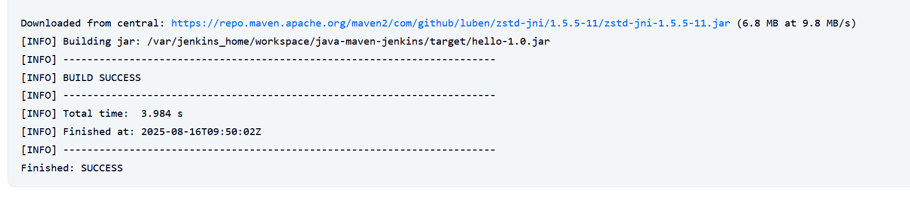

## Steps Performed

### 1. Start Jenkins
- Jenkins running locally via Docker  
- Accessed the Jenkins dashboard at `http://localhost:8080`

### 2. Configure Maven
- Go to **Manage Jenkins → Global Tool Configuration → Maven**  
- Added Maven version `3.9.11`  
- Enabled **Install automatically**

### 3. Create a Freestyle Project
- Created a new Freestyle job named `java-maven-jenkins`  
- Configured the job to use the Maven version added earlier  

### 4. Configure Source Code Management
- Selected **Git**  
- Added the project url
- Added credentials 

### 5. Add Build Step
- Invoke top-level Maven targets  
- Set goal to `clean package`  

### 6. Run the Job
- Clicked **Build Now**  
- Checked Console Output for success  

**Build Success Screenshot:**  

